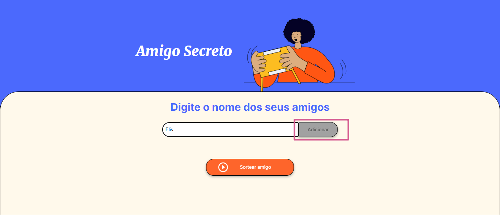
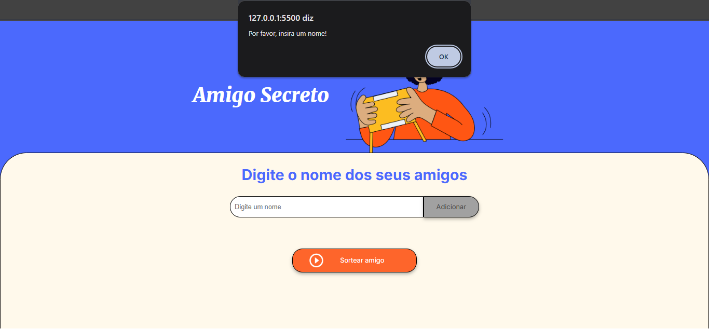
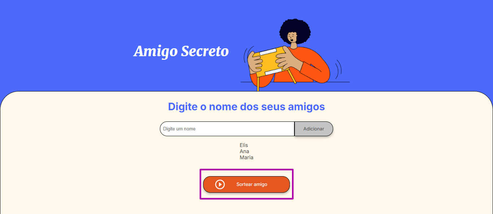
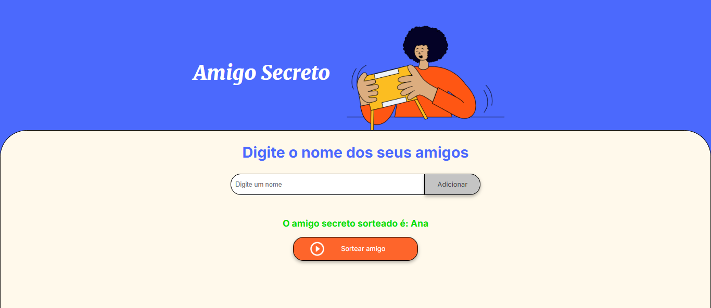
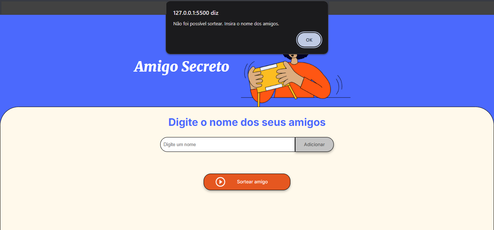

<h1>Sorteio de Nomes - Amigo Secreto</h1>

<h2>📚 Sobre</h2>

Esse projeto foi realizado como parte da formação de Iniciante de Programação do programa de estudos da Oracle Next Education em parceria com a Alura. Nele foi implementada a lógica de sortear nomes para realizar a brincadeira de amigo secreto.

<h2>💻 Tecnologias</h2>

    
    
    

<h2>🧩 Como executar o projeto?</h2>
<ol>
    <li style = "margin-bottom: 15px"> Digite o nome dos seus amigos, de cada vez, no campo "Digitar um nome" e clique no botão "Adicionar"; </li>
    
    <li style = "margin-bottom: 15px"> Caso você não tenha digitado um nome e clicou no botão, aparecerá um alerta, pedindo para que insira um nome; </li>
    
    <li style = "margin-bottom: 15px"> Quando finalizar a adição dos nomes, clique no botão "Sortear amigo", e aparecerá na tela o nome do amigo sorteado; </li>
    
    
    <li style = "margin-bottom: 15px"> Se você clicar no botão de sortear, sem tiver adicionado nenhum nome, um alerta é enviado, dizendo que não foi possível realizar o sorteio, pois não existe nenhum nome. </li>
    
</ol>